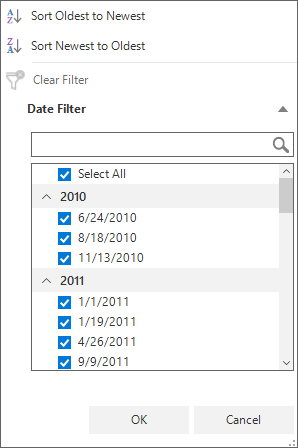

# How to group the date value displayed in FilterControl by year in WinForms DataGrid (SfDataGrid)?

## About the sample

This sample illustrates how to group the date value displayed in FilterControl by year in WinForms DataGrid (SfDataGrid).

[WinForms DataGrid](https://www.syncfusion.com/winforms-ui-controls/datagrid) (SfDataGrid) allows you to group the date value displayed in the filter popup of the [GridDateTimeColumn](https://help.syncfusion.com/cr/windowsforms/Syncfusion.WinForms.DataGrid.GridDateTimeColumn.html#%22%22) based on the year. This can be achieved by handling the [SfDataGrid.FilterPopupShown](https://help.syncfusion.com/cr/windowsforms/Syncfusion.WinForms.DataGrid.SfDataGrid.html#Syncfusion_WinForms_DataGrid_SfDataGrid_FilterPopupShown) event.


``` C#

public Form1()
{
    InitializeComponent();

    this.sfDataGrid1.FilterPopupShown += OnSfDataGrid1_FilterPopupShown;
}

private void OnSfDataGrid1_FilterPopupShown(object sender, Syncfusion.WinForms.DataGrid.Events.FilterPopupShownEventArgs e)
{
    if (e.Column.MappingName == "OrderDate")
    {

        e.Control.CheckListBox.View.GroupDescriptors.Add(new GroupDescriptor()
        {
            PropertyName = "ActualValue",
            KeySelector = (object obj1) =>
            {
                var item = (obj1 as FilterElement);
                var dateValue = (DateTime)item.ActualValue;
                return dateValue.Year.ToString();
            }
        });
    }
}

```



## Requirements to run the demo

Visual Studio 2015 and above versions

